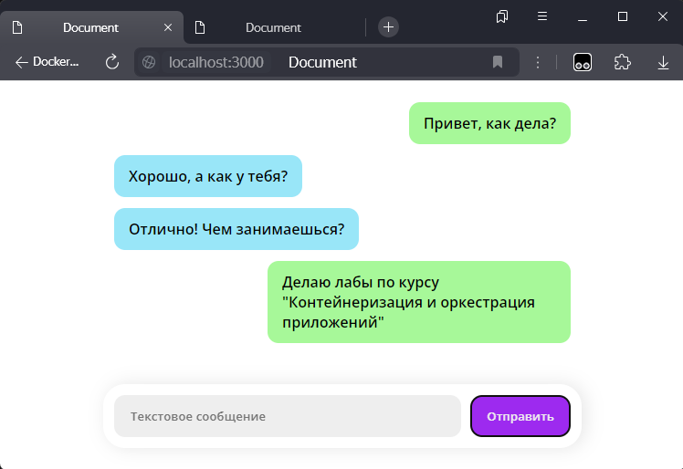

# Домашние задания
Домашние задания по курсу "Контейнеризация и оркестрация приложений".

Структура файлов и папок:
- attachments - служебная папка для вложений для README
- project - развертываемое приложение
  - server - сервер Express
- lab1 - Работа 1
- lab2 - Работа 2
- lab3 - Работа 3
- lab4 - Работа 4

# Развертываемое приложение

Развертываемое приложение представляет из себя небольшое приложение, написанное на Node.js, Express и Socket.io. При запуске приложения и переходе в него открывается страница с чатом. При отправке нового сообщения, оно будет доставлено всем подключенным участникам.

