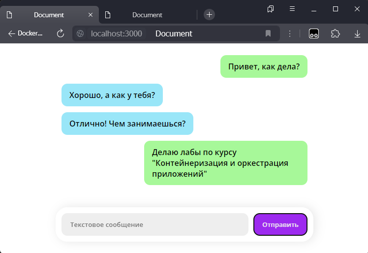

# Работа №1

Аннотация

В данной работе написано два Dockerfile:
- "Плохой" - с тремя плохими практиками
- "Хороший" - в нем три плохие практики исправлены

Также описаны две плохие практики по использованию именно этих контейнеров и два случая когде не стоит использовать контейнеры в целом.

## Структура файлов и папок:
- `lab1/bad/Dockerfile` - пример "плохого" докерфайла, в котором допущены три плохие практики (подробнее ниже)
- `lab1/good/Dockerfile` - "хороший" докерфайл, в котором исправлены плохие практики
- `attachments` - папка для вложений для README.md
- `README.md` - описание работы

## "Плохой" Dockerfile

1. Использование тега latest может поломать приложение,
если вдруг выйдет обратно несовместимая версия базового образа. При использовании собственных образов это также плохая практика, так как новый latest переписывает старый и откатить версию образа при какой-либо ошибке в нем будет проблематично.
2. Сначала копируем все файлы через `COPY ./project/server /var/www/app` и только потом запускаем `npm install`. Это приведет к тому, что при изменении любого файла в репозитории произойдет повторная установка зависимостей, так как в данном случае кеш не будет использован.
3. Не используются томы. Тогда все данные приложения будут сохраняться внутри контейнера и будут теряться при перезапуске.

## "Хороший" Dockerfile
То как исправлены плохие практики из "плохого" докерфайла:

1. Вместо тега latest использует статичный тег 22-alpine, который позволит использовать всегда одну и ту же версию базового образа.
2. Сначала происходит копирование только `package.json`, после чего запускается установка зависимостей `npm install` и только после этого копирование всех остальных файлов проекта. Благодаря этому, если в новой версии приложения не поменялся список зависимостей, то они будут установлены из кеша докера, что ускорит сборку.
3. В "Хорошем" докерфайле использует том, который позволит сохранить данные приложения при перезапуске контейнера.

## Плохие практики по использованию данных контейнеров

1. Хотя в "хорошем" Dockerfile и используется том, в реальной жизни такое использование не очень применимо. Это связано с тем, что в данном случае для том не указана явно директория хостовой системы, поэтому в него будет проблематично записать что-либо извне или расшарить его между несколькими контейнерами.
2. В Dockerfile не указан явно пользователь, что потенциально может стать проблемой для безопасности

## Когда не нужно использовать контейнеры

1. Контейнеризация монолитных приложений приведет к созданию очень больших контейнеров, что негативно скажется на времени сборки приложения а также производительности.
2. В очень маленьких приложениях. Например, когда приложение представляет из себя статичный сайт нет никакого смысла упаковывать его в контейнер. Это только добавит оверхед на виртуализацию и прочее.

## Сборка и запуск контейнеров

Контейнеры собирались и запускались командами из корня репозитория:

"Плохой" контейнер

`docker build -f lab1/bad/Dockerfile -t lab1_bad .`

`docker run -d -p 3000:3000 lab1_bad`

"Хороший" контейнер

`docker build -f lab1/good/Dockerfile -t lab1_good .`

`docker run -d -p 3000:3000 lab1_good`

## Результат

Результат запуска контейнера с приложением на скриншоте:
