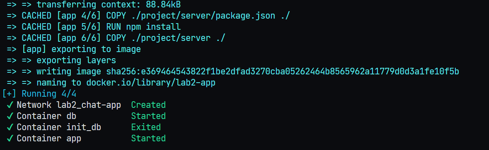

# Работа №2

Аннотация

В данной работе, в дополнение к основному приложению, были добавлены два контейнера:
- Экземпляр приложения с командой для запуска миграции БД;
- БД PostgreSQL
  
Для управления контейнерами написан docker-compose.yml

## Структура файлов и папок:
- `attachments` - папка для скриншотов и вложений README
- `app/Dockerfile` - докерфайл с образом приложения (копия "хорошего" докерфайла из первой работы)
- `volumes` - примонтированная директория для томов приложения и postgres. Находится в .gitignore
- `.env` - файл с переменными окружения. Оставлен в репозитории для возможности запуска
- `.env.example` - шаблон .env файла
- `docker-compose.yml` - docker compose
- `README.md` - описание работы
- `CHANGES.md` - change log

## Что сделано

Пайплайн следующий:
- Запуск БД
- Запуск Миграции БД
- Запуск приложения


Написан docker-compose.yml, в котором:

- Созданы три контейнера:

  1. postgres - база данных PostgreSQL
  2. init_db - инит контейнер для запуска миграции БД (экземпляр приложения, который останавливается после выполнения)
  3. app - непосредственно приложение. Слушает входящие запросы

- Для сборки контейнера `app` используются параметры `build` со ссылкой на Dockerfile приложения
- Указано жесткое именование контейнеров: `db`, `init_db`, `app` соответственно
- Сервис `app` зависит от успешного выполнения `init_db`, который в свою очередь зависит от запуска сервиса `postgres`.
- Для сервисов `postgres` и `app` указаны томы: для БД примонтирована хостовая директория `volumes/postgres`, для приложения `volumes/app`, а также через том проброшен файл `.env`
- Для сервисов `postgres` и `app`  прокинуты порты 5432 и 3000 соответственно
- Для сервиса `init_db` указан параметр entrypoint, который перезаписывает таковой в Dockerfile. Нужно, чтобы вместо команды запуска на прослушивание входящих запросов выполнилась команда на запуск миграции
- Добавлен `healthcheck` для сервиса `app`
- Для сервисов `postgres` и `init_db` указан параметр env_file, который говорит, где лежит .env файл
- Для всех сервисов явно указана сеть `chat-app`

## Запуск

Запуск производился из корня репозитория командой `docker compose -f lab2/docker-compose.yml up -d`

## Результат



## Ответы на вопросы

### Ограничение ресурсов

Для ограничения ресурсов контейнера можно использовать такой конфиг (пример из документации):

```
services:
  frontend:
    image: example/webapp
    deploy:
      resources:
        limits:
          cpus: '0.50'
          memory: 50M
          pids: 1
        reservations:
          cpus: '0.25'
          memory: 20M
```

### Запуск отдельного сервиса

Для запуска можно использовать команду: `docker compose up service`.

В контексте данной работы `docker compose -f lab2/docker-compose.yml up app -d`