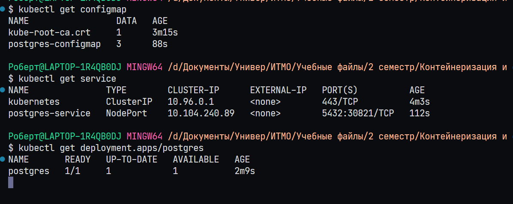
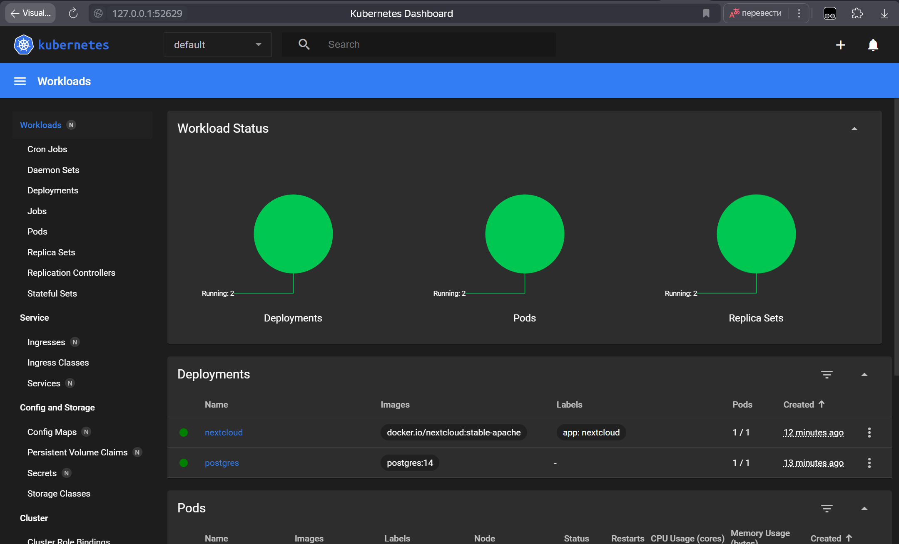

# Работа №3

Аннотация

В данной работе, выполнена установка Kubernetes на локальную машину в виде minikube. Развернут тестовый сервис из примера к работе.

Также осуществен перенос учетных данных Postgres из ConfigMap в Secrets, для NextCloud перенесены параметры из Deployment в ConfigMap. Добавлены пробы для NextCloud. Написаны ответы на вопросы из работы.

# Ход работы
## Установка minikube

1. Запустили Docker Desktop - он был установлен с работы №1
   


2. Скачал утилиту для работы с Kubernetes CLI
3. Настроил среду для работы: добавил kubectl.exe в переменные окружения Windows для удобной работы с утилитой из любого места в системе.
   


4. Установил minikube
   


5. Проверил, что minikube работает. Выполнил команду `minicube version` и посмотрел версию - 1.33.1


6. Запустил minikube командой `minikube start`. Все запустилось, в Docker Desktop появился новый контейнер.


7. Через CLI контейнер тоже отображается


8. Порадовался, что все быстро запустилось и заработало.

## Создание объектов через CLI

1. Создал манифесты конфигмапа (`pg_configmap.yml`), сервиса (`pg_service.yml`) и дейплоймента (`pg_deployment.yml`). В качестве значения пароля для postgres установил `super_strong_password`. 

2. При помощи команды `kubectl create -f manifest.yml` добавил все манифесты в кластер.


3. Через команду `kubectl get <resource>` проверил, что ресурсы создались.


4. Далее был создан nextcloud.yml и по аналогии с Postgres, Nextcloud был добавлен в кластерю 


## Подключение извне

1. Для локального подключения к сервису Nextcloud было добавлено перенаправление порта через команду `kubectl expose deployment nextcloud --type=NodePort --port=80`
   


2. Далее было выполнено тунеллирование трафика при помощи команды `minikube service nextcloud`
   


3. Далее открыл Nextcloud в браузере, перейдя по URL из терминала.


4. Также установил дашборд командой `minikube dashboard --url`. Открыл панель управления в браузере.
   


5. При помощи панели управления, установил количество реплик Postgres в 0, а затем в 1.


Видим, что Nextcloud перестал работать.


## Доработка манифестов

1. Использование учетных данных, таких как POSTGRES_USER и POSTGRES_PASSWORD в ConfigMap не очень хорошая идея. Лучше для этого использовать Secrets, так как в таком случае данные будут скрыты.
   
Для этого был добавлен манифест `pg_secrets.yml` с учетными данными. При этом из `pg_confgimap.yml` были удалены значения `POSTGRES_USER` и `POSTGRES_PASSWORD`, так как они там больше не нужны. В `pg_deployment.yml` в env добавил 
```YAML
- secretRef:
    name: postgres-configmap
```
2. Переменные nextcloud были перенесены из Deployment в ConfigMap (находится также внутри `nextcloud.yml`). Для того, чтобы сослаться на конфигмапу, в deployment был использован параметр envFrom
3. Добавлены Liveness и Readniss пробы:
```YAML
readinessProbe:
   httpGet:
     path: /
     port: 80
   initialDelaySeconds: 60
   periodSeconds: 30
livenessProbe:
   httpGet:
     path: /
     port: 80
   initialDelaySeconds: 60
   periodSeconds: 30
```

 ## Ответы на вопросы

1. Важен ли порядок выполнения манифестов? Почему?
   
Да, важен, так как в некоторых манифестах мы ссылаемся на другие манифесты. Например, деплоймент зависит от конфигмапы.

 2. Что (и почему) произойдет, если отскейлить количество реплик postgres-deployment в 0, затем обратно в 1, после чего попробовать снова зайти на Nextcloud? 
   
В случае установки реплик в 0 и попытке зайти на Nextcloud, будет ошибка, так как поды БД будут остановлены, и NextCloud будет не к чему подключаться. При последующей установке количества реплик в 1 будет запущен под с БД, но NextCloud по прежнему не будет работать, так как его нужно переинициализировать.