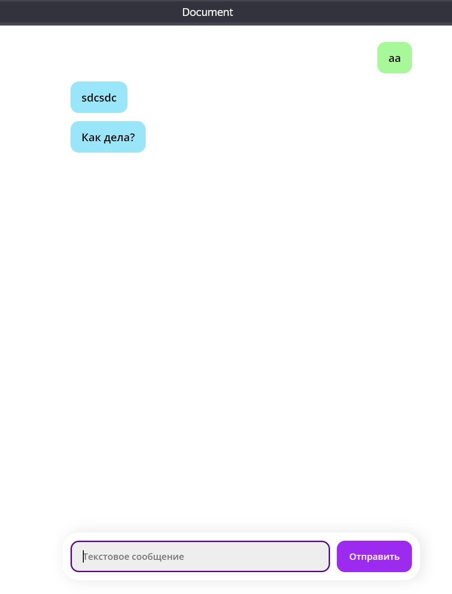
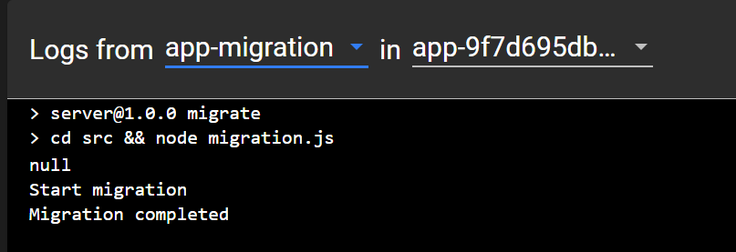
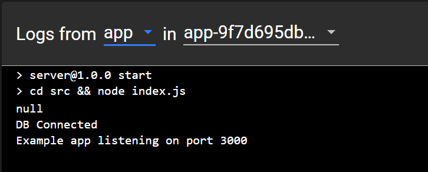

# Работа №3

Аннотация

В данной работе, выполнено развертывание собственного приложения на Node.js в Kubernetes. Приложение состоит из 3-х контейнеров:
- Приложение
- Миграция БД (инит контейнер)
- БД Postgres
  
## Структура файлов и папок:
- `attachments` - папка для скриншотов и вложений README
- `app/Dockerfile` - докерфайл с образом приложения (копия "хорошего" докерфайла из первой работы)
- `app.yml` - манифест приложения
- `postgres.yml` - манифест БД
- `CHANGES.md` - небольшой change log
- `README.md` - описание работы

# Ход работы

За основу были взяты манифесты из предыдущей работы. Для развертывания используется два манифеста:
1. `postgres.yml` - содержит секрет, конфигмап, деплоймент и сервис для БД.
2. `app.yml` - манифест приложения.
   
`app.yml` содержит:
- сборку приложения из `app/Dockerfile` через локальный регистри в докере.
- конфигмап (с одним параметром (также используется `postgres-configmap`), который прокидывается в envFrom в deployment)
- собственного секрета нет, но используется `postgres-secret` из `postgres.yml`
- деплоймент с инит контейнером для миграции БД и непосредственно приложением
- сервис для приложения
- для приложения и миграции прописан volume.
- для приложения прописаны Liveness и Readiness пробы, которые стучатся в `/healtcheck` (добавлен в работе 2)

## Запуск

Сначала попробовал использование локального регистри для образов. Для этого:

Из labs/:

`docker context use default` 

Переиспользуем демона docker внутри кластера minikube [1]

`eval $(minikube docker-env)`

Запускаем контейнер с регистри:

`docker run -d -p 5000:5000 --restart=always --name registry registry:2`

Выполняем сборку образа приложения

`docker build -f lab4/app/Dockerfile -t localhost:5000/lab4:1.0 .`

Пушим в регистри:

`docker push localhost:5000/lab4:1.0`

Переходим в директорию с текущей работой:

`cd lab4` 

Добавляем манифесты:

1. `kubectl create -f postgres.yml`
2. `kubectl create -f app.yml`

Открвааем сервис и проверяем работу:

`minikube service app`

Также через дашборд можно убедиться, что приложение и миграция отработали штатно:

### Эксперимент с Docker Hub

Также для собственного развития попробовал использовать docker hub для собственных образов. Для этого:

Авторизовался при помощи
`docker login`

Собрал приложение

`docker build -f lab4/app/Dockerfile -t containerlabsitmo/lab4:1.0 .`

И запушил

`docker push containerlabsitmo/lab4:1.0`

Для использования этого образа нужно поменять image в контейнере и инит контейнере в `app.yml` вот так: `image: containerlabsitmo/lab4:1.0`.

Остальные шаги идентичны предыдущему разделу после команды `cd`.

# Источники

1. https://minikube.sigs.k8s.io/docs/handbook/pushing/#1-pushing-directly-to-the-in-cluster-docker-daemon-docker-env